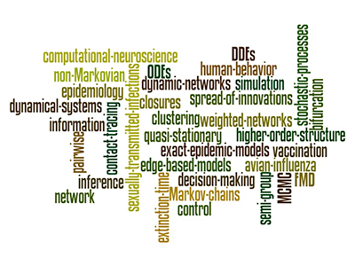
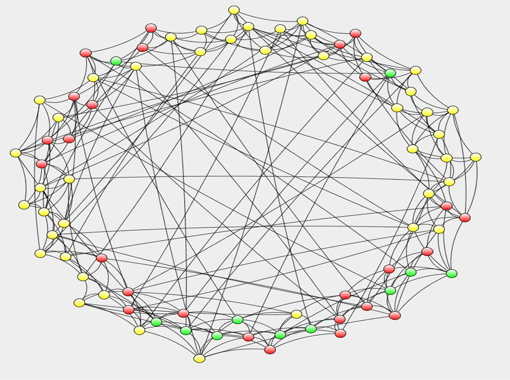
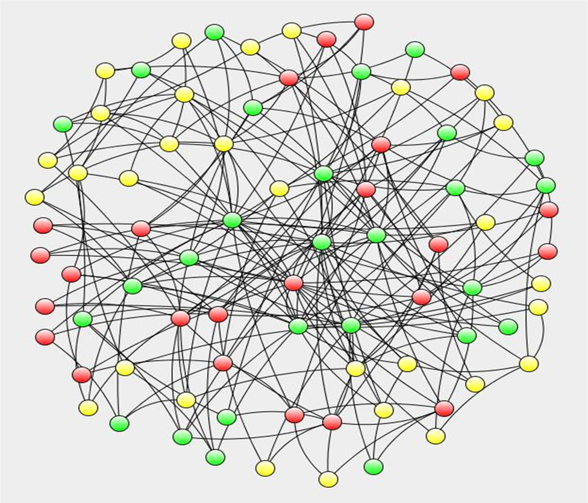
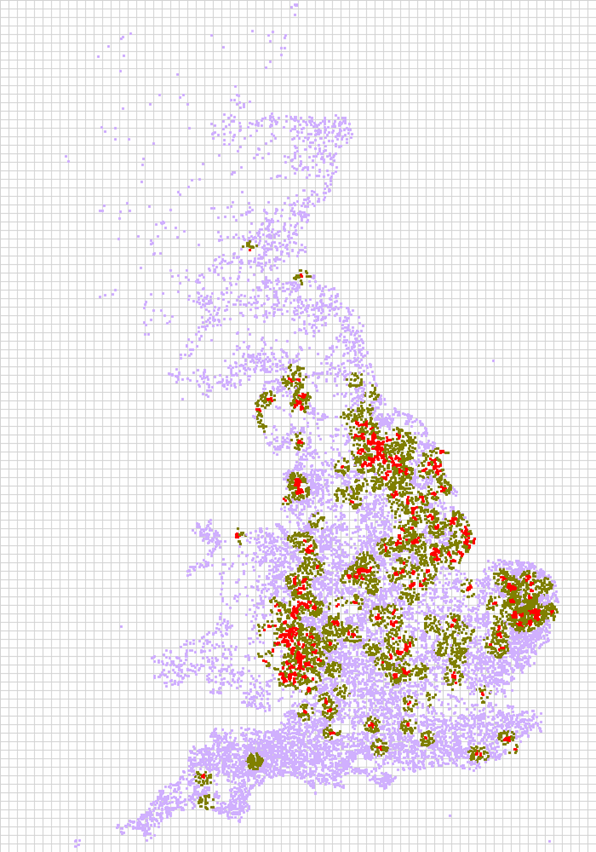

István Z. Kiss is a Professor in the Network Science Institute at Northeastern University London. His research is at the interface of network science, dynamical systems and stochastic processes, and concerns both theoretical and data-driven problems. Examples include network inference, exactness of mean-field models, temporal and higher-order networks, adaptive/dynamic networks, resilience of power networks and the study of spreading processes in general.

			<main>
				

					
Funders

					  
					  
					  
					  
					
				

				

				<!-- Start of Content -->
				
					<!-- 

						
					

					

						Dr Istvan Kiss 
						School of Mathematical  
						and Physical Sciences  
						Department of Mathematics 
						Pevensey III 
						University of Sussex 
						Brighton, BN1 9QH 
						United Kingdom 
						Office:  +44 (0) 1273 873021 
						Room: 5C6  
						Email: i.z.kiss (at) sussex.ac.uk 
						<a href='http://scholar.google.co.uk/citations?hl=en&user=Wf3AWDUAAAAJ' target='_blank'> [Google scholar profile]</a>
						 
						 
					
 -->
					

						
					

					
&nbsp;

					

						
						
						
						
					

					

						
&nbsp;

						
Funders

						

							
							
							
							
							
						

					

				
				<!-- End of Content -->
				

			</main>