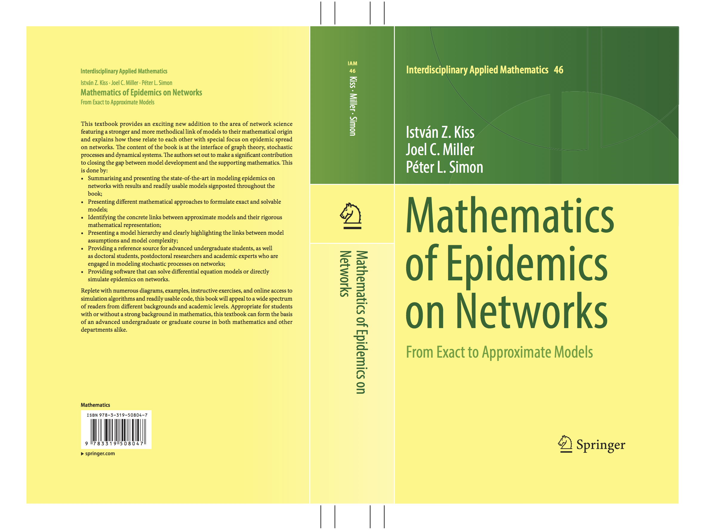

István Z. Kiss is a Professor in the <a href='https://www.networkscienceinstitute.org/'> Network Science Institute </a> at <a href='https://www.nulondon.ac.uk/'> Northeastern University London </a>. His research is at the interface of network science, dynamical systems and stochastic processes, and concerns both theoretical and data-driven problems. Examples include network inference, exactness of mean-field models, temporal and higher-order networks, adaptive/dynamic networks, resilience of power networks and the study of spreading processes in general.

 

<table>
<tr>
<td></td>
<td></td>
<th rowspan="2"> <right></right></th>
</tr>
<tr>
<td></td>
<td>

</td>
</tr>
</table>